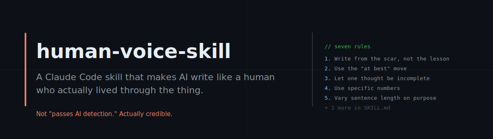

<p align="center">
  
</p>

<p align="center">
  <a href="https://github.com/designbysuren/human-voice-skill/stargazers"></a>
  <a href="https://github.com/designbysuren/human-voice-skill/network/members"></a>
  
  
  
  
</p>

---

A Claude Code skill that makes AI write like a human who actually lived through the thing.

Not "passes AI detection." Actually credible.

---

## The Problem

AI writing has a signature. Developers and readers recognize it in seconds.

- Every paragraph is the same length
- Every claim is explained right after it is made
- Nothing is ever admitted as a mistake
- Every analogy is introduced as "to illustrate this concept"

You can feel it. It does not matter if the facts are right. The writing feels generated, which means it feels unearned.

This skill fixes that.

---

## What This Skill Does

It teaches Claude seven rules for writing that sounds like a person thought it, doubted it, and then typed it anyway.

The rules are based on a simple observation: what makes writing feel human is not complexity or cleverness. It is texture. Second thoughts. The specific number instead of the vague one. The sentence that does not resolve. The analogy that arrives mid-thought without announcement.

This skill encodes those patterns and suppresses the AI defaults that kill credibility.

---

## Install

**Claude Code (recommended):**

```bash
git clone https://github.com/designbysuren/human-voice-skill ~/.claude/skills/human-voice-skill
```

Claude will automatically detect and use the skill when relevant.

**Manual:**

Copy `SKILL.md` into any `.claude/skills/` directory in your project. Claude Code discovers skills automatically.

---

## Usage

Once installed, reference the skill in any writing prompt:

```
Write a blog post about why we deprecated our feature flags system.
Use the human-voice skill.
```

For voice matching:

```
Here are three examples of how I write: [paste samples]
Using the human-voice skill, write a LinkedIn post about our launch.
```

The skill will:

- Extract your rhythm, hedging style, and admission pattern from the samples
- Apply the seven rules
- Suppress the AI writing defaults
- Check the output against the signature lines test before finishing

---

## The Seven Rules

| # | Rule | What it fixes |
|---|------|--------------|
| 1 | **Write from the scar, not the lesson** | AI starts with what was learned. Humans start with the moment they were still wrong. |
| 2 | **Use the "at best" move** | AI states things cleanly. Humans hedge in ways that show they thought harder. |
| 3 | **Let one thought be incomplete** | AI resolves every tension. Humans drop a thread sometimes. |
| 4 | **Use specific numbers** | AI says "several." Humans say "three." |
| 5 | **Vary sentence length on purpose** | AI writes in even rhythm. Humans don't. |
| 6 | **Self-blame once, specifically** | AI says "we failed to validate." Humans say "I built it for myself." |
| 7 | **Let analogies arrive late** | AI announces analogies. Humans find them mid-thought. |

Full rules with examples and the suppression list are in [`SKILL.md`](SKILL.md).

---

## Quick Example

**Before:**

> "When working with AI tools, it is important to consider the quality of your prompts. Research has shown that clear and specific instructions lead to better outputs."

**After:**

> "I spent six weeks blaming the model. The outputs were vague, circular, not useful. Then a colleague looked over my shoulder for ten minutes and asked one question: what do you actually want it to do?
>
> I did not have an answer. That was the problem.
>
> At best, a prompt is the packaging of thinking. I had not done the thinking."

More worked examples in [`examples/`](examples/).

---

## Using with Other Agents

Claude Code is the only agent with native `.claude/skills/` auto-discovery. For every other agent, paste or reference `SKILL.md` using the method below.

---

### Codex CLI

Codex CLI reads from `AGENTS.md` in your repo root. Add this to your `AGENTS.md`:

```markdown
## Writing Style

When writing any prose, blog posts, LinkedIn posts, READMEs, changelogs, or essays,
apply the rules in SKILL.md (human-voice skill). Do not use AI writing defaults.
Reference the seven rules and the suppression list before generating output.
```

Or copy the full `SKILL.md` contents directly into `AGENTS.md` for offline use.

---

### Cursor

Cursor reads from `.cursorrules` in your repo root. Add this:

```
When the user asks for any writing (blog posts, LinkedIn posts, READMEs,
changelogs, documentation with personal tone), apply the human-voice skill.
The rules are in SKILL.md. Follow all seven rules and the suppression list.
Do not use AI writing defaults. Run the signature lines test before finishing.
```

---

### Windsurf

Windsurf reads from `.windsurfrules`. Same pattern as Cursor:

```
For any writing tasks, apply the human-voice skill rules from SKILL.md.
Seven rules. Suppression list. Signature lines test. No AI writing defaults.
```

---

### Opencode

Opencode supports `AGENTS.md` (same as Codex CLI). Use the same snippet from the Codex section above.

---

### ChatGPT / API / Custom GPTs

No config file. Two options:

**Option 1: Paste into system prompt**

Copy the full contents of `SKILL.md` into the system prompt of your GPT or API call.

**Option 2: Reference at prompt time**

```
[Paste SKILL.md contents here]

---

Now write a blog post about [topic].
```

For a Custom GPT, paste `SKILL.md` into the "Instructions" field. The skill will apply to every conversation in that GPT.

---

### Quick Reference

| Agent | Config file | Method |
|-------|------------|--------|
| Claude Code | `.claude/skills/` | Auto-discovery |
| Codex CLI | `AGENTS.md` | Paste reference or full content |
| Cursor | `.cursorrules` | Paste reference |
| Windsurf | `.windsurfrules` | Paste reference |
| Opencode | `AGENTS.md` | Paste reference or full content |
| ChatGPT / API | System prompt | Paste full content |

---

## Who This Is For

- Developers writing technical blog posts or essays
- Founders writing LinkedIn content or launch posts
- Technical writers who want READMEs that feel authored
- Anyone who has been told "this sounds AI-generated" and did not know how to fix it

---

## Repo Structure

```
human-voice-skill/
  README.md                          <- you are here
  SKILL.md                           <- the skill Claude reads and applies
  examples/
    blog-post.md                     <- technical post, before/after with annotations
    linkedin-post.md                 <- short-form post, before/after with annotations
  philosophy/
    voice-calibration.md             <- how to match a specific person's voice
  assets/
    banner.svg                       <- repo banner
```

---

## Contributing

The rules are intentionally opinionated. If you have a pattern that consistently makes AI writing feel more human and is not already covered, open an issue with a before/after example.

Pull requests adding examples for specific formats (changelogs, post-mortems, release notes, cold emails) are welcome.

---

## License

MIT
